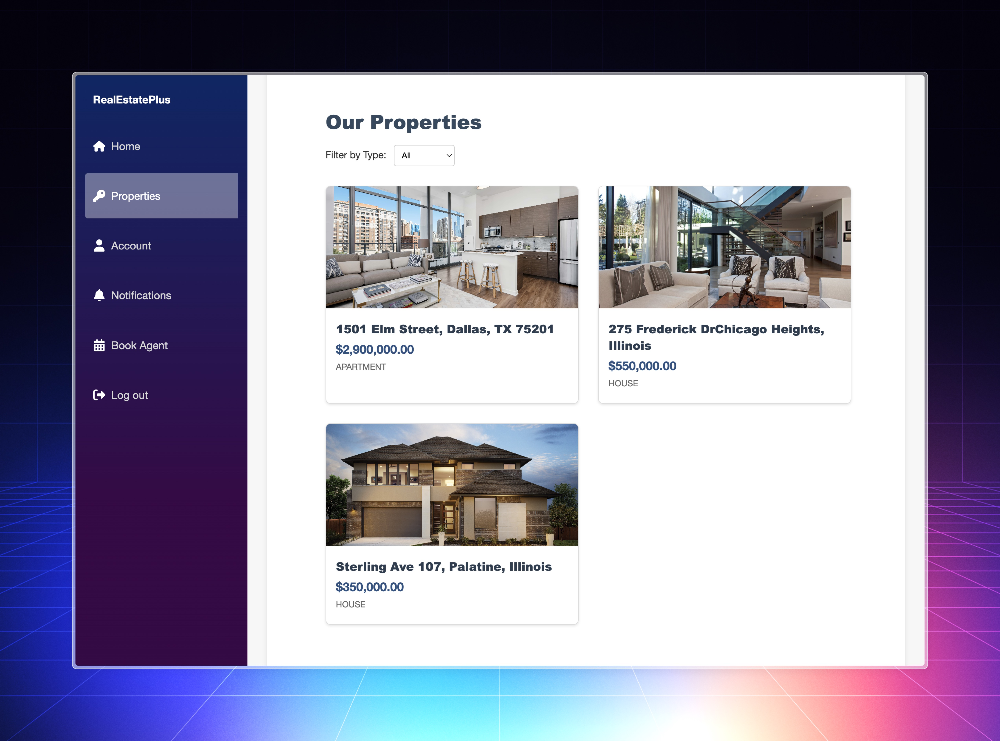
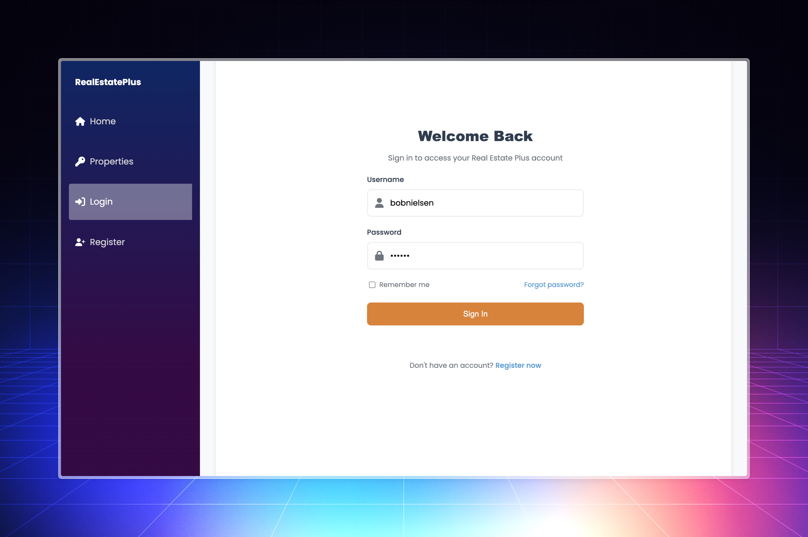
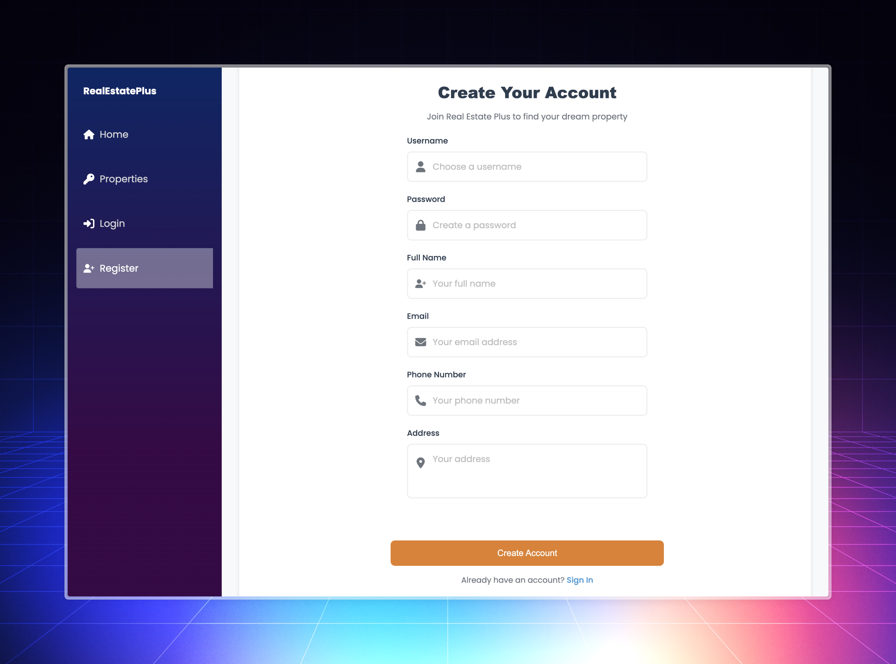
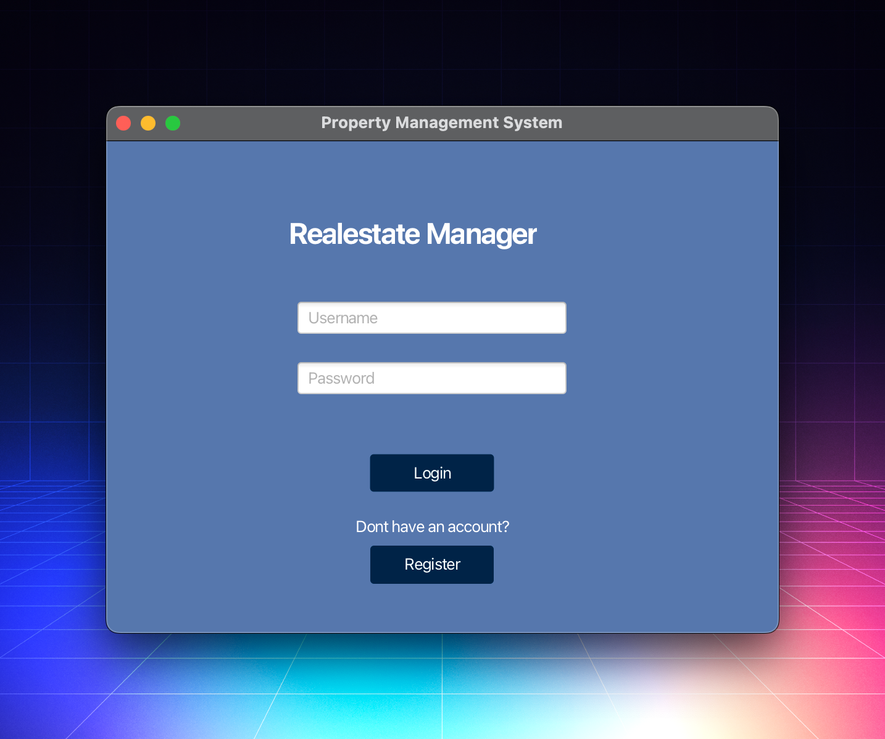
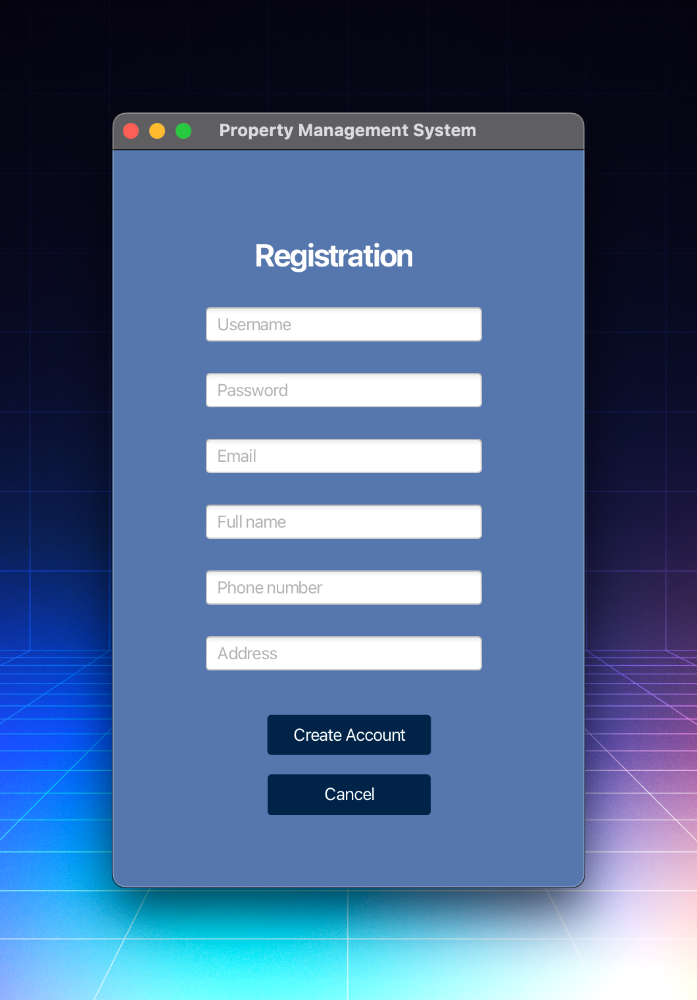
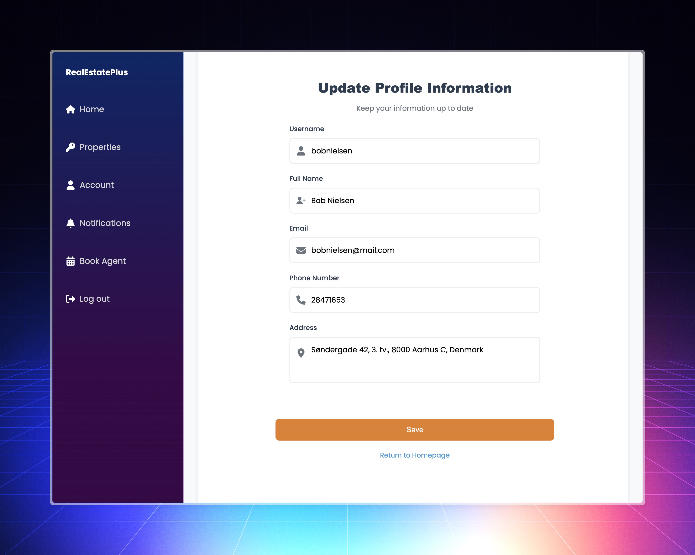
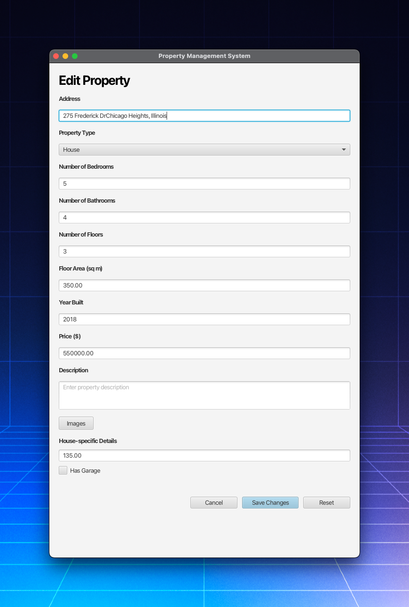
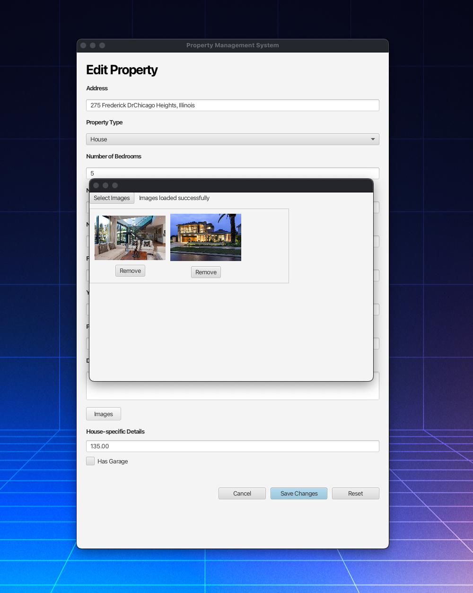
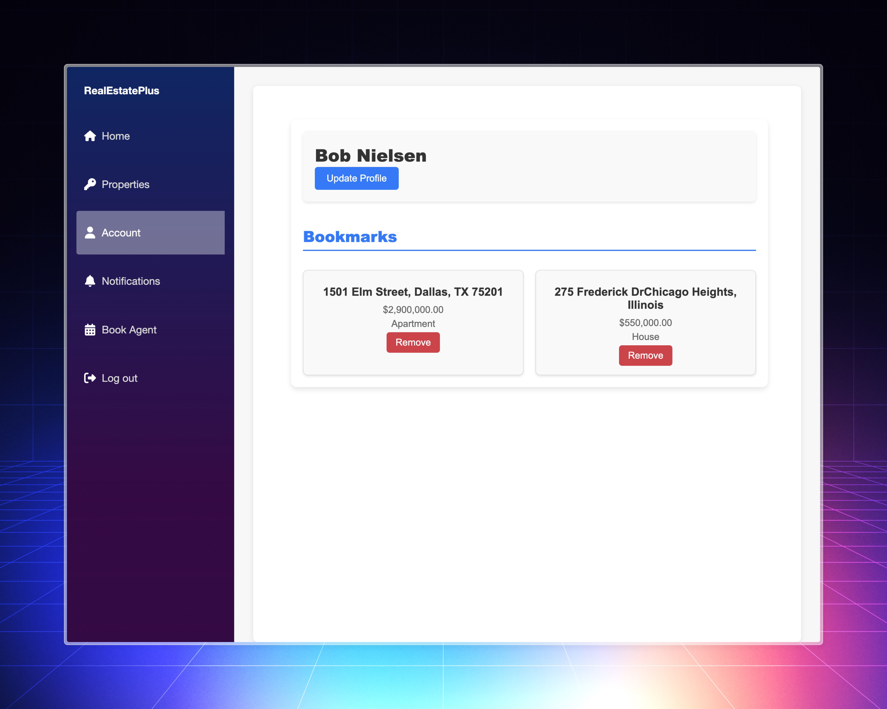

# SEP3

This project was developed as part of our third semester project (SEP3) for our **Software Engineering** degree.

The goal of the semester project was to design and implement a distributed system consisting of at least two servers. Our team chose to build a system for a fictional real estate agency called **Real Estate Plus**.

## Project Structure

The project is structured as follows:

- `/Blazor`: A Blazor web application for customers.
- `/GUI`: A JavaFX desktop application designed for administrative users.
- `/restful-server`: A Java Spring Boot REST server that handles backend operations and API requests.
- `/signalr-server`: A SignalR server that delivers real-time notifications to the Blazor web application.

## Functional Requirements

The system was designed to meet the following functional requirements defined through user stories. Each user story represents a specific feature or capability written to reflect the user's goals and interactions with the system.

**Create user account:** As a customer, I want to have the ability to create an account, so that I can access extra features like save bookmarks and book an agent.

**Create administrator account:** As an administrator, I want to have the ability to create an account, so that I can manage properties, bookings, and agents.

**Update user information:** As a customer, I want to be able to update my user account details, so that the agency can still contact me if my information changes.

**Property filters:** As a customer, I want to have the ability to use filters such as, property type, so that I can find a property that matches my needs.

**Book agent:** As a customer, I want to be able to book an appointment with an agent, so that I can receive further information and ask questions about a specific property.

**Bookmark property listings:** As a customer, I want to be able to bookmark listings, so that I can easily revisit and review them later.

**Real-time notifications:** As a customer, I want to receive notifications about my bookmarked properties, so that I can stay updated on any changes to them.

**Search in admin dashboard:** As an administrator, I want to be able to search for property listings, so that I can quickly find the specific property I’m looking for.

**Create property listing:** As an administrator, I want to be able to create new property listings, so that they can be added to the website.

**Upload property images:** As an administrator, I want to be able to upload images of properties, so that customers can visually assess whether they are interested in a property.

**Update property details:** As an administrator, I want to be able to update the details of property listings, so that I can ensure all information remains accurate and up to date.

**Delete property listing:** As an administrator, I want to be able to delete property listings, so that outdated or irrelevant listings no longer appear to customers.

## System Implementation

### Tech Stack

- **Frontend (Web):** Blazor
- **Frontend (Desktop):** JavaFX
- **Backend (REST API):** Java Spring Boot
- **Real-time notifications:** SignalR
- **Database:** PostgreSQL

## Project Features

### User authentication

**Blazor web application for customers:**

**JavaFX desktop application for administrators:**

**Role-based authentication**\
The system uses role-based authentication to manage access and permissions.

There are two distinct user roles: `USER` and `ADMIN`.

- Customers who register for an account through the Blazor web application are automatically assigned the `USER` role.
- Administrators who register through the JavaFX desktop application are automatically assigned the `ADMIN` role.

Administrators have additional privileges, such as managing property listings. Therefore, it is important to distinguish between administrators and customers. This ensures that customers cannot access API endpoints they are not authorized to use.

**API endpoint security**\
Access control is enforced by our Java REST API, which uses Spring Security to handle authentication and authorization.
Endpoint security is achieved by using `@PreAuthorize("hasRole('ADMIN')")` on endpoints that only administrators are allowed to access.

### Update user information

Users can update their account information by going to `Account` and clicking on `Update Profile`.

From this view, users can change:

- Username
- Full name
- Email address
- Phone number
- Address

Form fields are pre-filled with the user’s current information, making it easy to edit.

As a security measure, updating sensitive data such as the username or email address requires the user to enter their password. This is to prevent unauthorized changes in case the JWT session token is compromised.

### Manage property listings

Administrators can manage property listings through the JavaFX desktop application.

**Create property**\
Administrators can add new property listings by filling in the details such as price, address, property type, and upload images.

**Update property information**\
Details for existing property listings can be updated, such as changing the price.

Uploading additional images is also supported, as well as deleting existing images.

**Delete property**\
Administrators can remove properties that are no longer available or relevant from the system entirely.

### Manage agents

### Bookmark property listings

Users can save properties as bookmarks to easily view them later.
Bookmarked properties are displayed on the `Account` page, where users can also remove bookmarks for listings they are no longer interested in.

When changes happen to bookmarked properties, the user will receive a notification.
For example, if the price is updated. In this case, the user will receive a notification about the new price of the property.

### Book an agent

### Real-time notifications

A SignalR server was implemented to handle real-time notifications.
When a price change occurs, the Java REST server notifies the SignalR server, which then sends the real-time notification to the Blazor web application. This approach allows instant updates without requiring the user to refresh the page. SignalR was chosen for its speed and efficiency in delivering real-time notifications.
